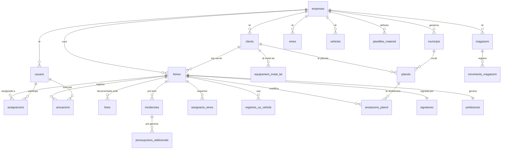

# GUIA MESTRE — CampoPro v2.0

> **Versió:** 2.0  
> **Data:** 2026-07-31  
> **Estat:** Pendent de validació — CAP CODI FINS APROVACIÓ  
> **Stack:** FastAPI + PostgreSQL 15 + Redis + Celery + Next.js 14 + Hetzner + EasyPanel

---

## NORMA SUPREMA

> **Aquest document és SAGRAT. Tot agent (Backend, Frontend, Seguretat) ha de consultar-lo ABANS de tocar qualsevol fitxer. Si un agent detecta una contradicció entre el codi i aquest document, el document GUANYA.**

### Protocol obligatori

1. **ABANS de codificar**: Llegir `docs/directrius_generals/GUIA_MESTRE.md`
2. **ABANS de corregir errors**: Llegir `docs/errors/ERRORS.md`
3. **ABANS d'avançar de nivell**: Validació completa del nivell actual (Frontend + Backend + Seguretat)
4. **MAI avançar** amb errors oberts, valors hardcoded, tests fallant, o vulnerabilitats detectades
5. **MAI inventar** funcionalitats no descrites aquí. Registrar-les a `docs/BACKLOG.md`

---

## 1. VISIÓ I PRINCIPIS

### 1.1 Què és CampoPro

CampoPro és una **eina de gestió de camp a mida** per a empreses de jardineria, instal·lacions i manteniment (5-50 treballadors). No és un SaaS: cada empresa rep la seva pròpia app amb el seu branding, domini i dades aïllades.

**Filosofia**: *"Invisible per al treballador, omniscient per a l'enginyer."*

### 1.2 Model de negoci

| Concepte | Descripció |
|-----------|------------|
| **Venda** | Setup inicial (personalització + formació + configuració) |
| **Manteniment** | Quota mensual: servidor, IA, backups, suport, actualitzacions |
| **Sense manteniment** | El client rep el Docker i gestiona el seu propi servidor |

### 1.3 Actors del sistema

| Actor | Rol | Auth | Interfície |
|-------|-----|------|-----------|
| **Super Admin** | Propietari de la plataforma, gestiona totes les empreses | Email + Password + TOTP 2FA + IP allowlist | Dashboard Super Admin |
| **Enginyer/Empresari** | Crea feines, assigna, revisa resultats, factura | Email + Password + TOTP 2FA | Dashboard Gestió (2 tabs) |
| **Operari** | Executa feines, reporta, fotos, signatures | PIN 4 dígits + Telèfon | PWA Mòbil |
| **Client** | Rep notificacions, signa, aprova pressupostos | Cap (Telegram Bot) | Bot Telegram |

### 1.4 Flux de 30 segons (promesa)

```
ENGINYER (matí):
  Crea feina → Plànol + Material + Eines + Assigna quadrilla

OPERARI (al lloc, PWA):
  Check-out eines ✓ → Foto comptador vehicle → Foto INICIAL (geoloc auto)
  → Botó INICIAR (2s) → Material +/- → Incidència foto+veu (si cal)
  → Foto FINAL → Anotació plànol si canvis → Signatura client QR
  → Check-in eines ✓ → Foto comptador vehicle → Botó FINALITZAR

AUTOMÀTIC (backend):
  Informe PDF + Pre-factura + Alerta estoc + Notificació Telegram
  + Versió plànol actualitzada (si canvis) + IA recalcula plantilles
```

---

## 2. ARQUITECTURA TÈCNICA DEFINITIVA

### 2.1 Stack

| Capa | Eina | Versió | Justificació |
|------|------|--------|--------------|
| **Backend API** | FastAPI | 0.110+ | Async natiu, OpenAPI auto-docs, Pydantic v2 |
| **Base de dades** | PostgreSQL | 15 | Self-hosted, RLS, triggers, PostGIS-ready |
| **Cache/Cua** | Redis | 7 | Sessions, cache, cua Celery, rate limiting, JWT blacklist |
| **Workers** | Celery + Beat | 5.3+ | PDF, OCR, IA batch, notificacions async |
| **PWA + Dashboard** | Next.js 14 | App Router | SSR/SSG, PWA natiu, white-label |
| **CSS** | Tailwind CSS | 3.4 | Utility-first, themeable amb CSS variables |
| **Bot Telegram** | aiogram | 3.x | Async natiu, botons inline, webhooks |
| **IA (visió)** | OpenRouter | API | Kimi K2 Vision (OCR, plànols) |
| **IA (text)** | OpenRouter | API | DeepSeek (suggeriments, resums) |
| **PDF** | ReportLab | 4.x | Generació server-side |
| **Fotos** | AWS S3 | — | Presigned URLs, baix cost, fiable |
| **Mapes** | Leaflet.js + OSM | — | Open source, overlay plànols |
| **Geocoding** | Nominatim | — | Open source, self-hostable |
| **Deploy** | Hetzner + EasyPanel | CPX21 | Docker orchestration, SSL auto, €14.70/mes |
| **Tests** | pytest | 7+ | Async support, fixtures |

### 2.2 Diagrama d'infraestructura

```
┌─────────────────────────────────────────────────────────────────┐
│                      HETZNER CPX21 (€14.70/mes)                 │
│  ┌───────────────────────────────────────────────────────────┐  │
│  │                       EasyPanel                           │  │
│  │  ┌──────────┐  ┌──────────┐  ┌───────┐  ┌────────────┐  │  │
│  │  │ FastAPI   │  │PostgreSQL│  │ Redis │  │  Celery    │  │  │
│  │  │ Uvicorn   │  │   15     │  │   7   │  │  Workers   │  │  │
│  │  │ Python3.12│  │ asyncpg  │  │       │  │  + Beat    │  │  │
│  │  └──────────┘  └──────────┘  └───────┘  └────────────┘  │  │
│  │  ┌──────────┐  ┌──────────────────────────────────────┐  │  │
│  │  │  Nginx   │  │         Next.js 14 (PWA)             │  │  │
│  │  │ SSL/Proxy│  │  (superadmin) (gestio) (operari)     │  │  │
│  │  └──────────┘  └──────────────────────────────────────┘  │  │
│  │  ┌──────────┐                                            │  │
│  │  │ aiogram  │  ← Bot Telegram                            │  │
│  │  │  Bot     │                                            │  │
│  │  └──────────┘                                            │  │
│  └───────────────────────────────────────────────────────────┘  │
└───────────────────────────┬─────────────────────────────────────┘
                            │
          ┌─────────────────┼─────────────────┐
          │                 │                 │
          ▼                 ▼                 ▼
┌──────────────┐  ┌──────────────┐  ┌──────────────┐
│  AWS S3      │  │  OpenRouter  │  │  Telegram    │
│  (Fotos)     │  │  (IA/OCR)    │  │  Bot API     │
│  €0.023/GB   │  │  Pay-per-use │  │  €0          │
└──────────────┘  └──────────────┘  └──────────────┘
          │
          ▼
┌──────────────┐
│ OpenStreetMap│
│ Nominatim    │
│ Leaflet.js   │
│ €0           │
└──────────────┘
```

### 2.3 Estructura de directoris

```
campopro/
├── docs/
│   ├── directrius_generals/
│   │   └── GUIA_MESTRE.md          ← AQUEST FITXER
│   ├── errors/
│   │   └── ERRORS.md               ← Registre errors + solucions
│   ├── agents/
│   │   ├── AGENT_BACKEND.md
│   │   ├── AGENT_FRONTEND.md
│   │   └── AGENT_SEGURETAT.md
│   ├── accions/                     ← Resums d'acció per nivell
│   ├── arxiu/                       ← Documents originals (referència)
│   ├── ESTAT.md                     ← Estat viu del projecte
│   └── BACKLOG.md                   ← Millores futures (NO implementar)
│
├── skills/                          ← Plantilles de codi per agent
│   ├── fastapi_crud.md
│   ├── postgresql_rls.md
│   ├── celery_worker.md
│   ├── pydantic_validator.md
│   ├── offline_sync.md
│   ├── ocr_openrouter.md
│   ├── telegram_handler.md
│   ├── pdf_reportlab.md
│   ├── openrouter_client.md
│   ├── pytest_fixture.md
│   ├── jwt_auth.md                  ← SEGURETAT
│   ├── api_rate_limiting.md         ← SEGURETAT
│   ├── input_sanitization.md        ← SEGURETAT
│   ├── secure_file_upload.md        ← SEGURETAT
│   ├── docker_hardening.md          ← SEGURETAT
│   ├── nginx_ssl_config.md          ← SEGURETAT
│   ├── backup_restore.md            ← SEGURETAT
│   ├── prompt_security.md           ← SEGURETAT
│   ├── design_system.md             ← DISSENY
│   ├── white_label_theming.md       ← DISSENY
│   └── pwa_patterns.md              ← DISSENY
│
├── backend/
│   ├── app/
│   │   ├── main.py
│   │   ├── config.py
│   │   ├── dependencies.py
│   │   ├── api/
│   │   ├── models/
│   │   ├── services/
│   │   ├── core/
│   │   └── middleware/
│   ├── tests/
│   ├── scripts/
│   ├── requirements.txt
│   └── Dockerfile
│
├── pwa/
│   ├── app/
│   │   ├── (superadmin)/
│   │   ├── (gestio)/
│   │   └── (operari)/
│   ├── components/
│   ├── lib/
│   └── Dockerfile
│
├── bot/
│   ├── handlers/
│   ├── services/
│   └── Dockerfile
│
├── infra/
│   ├── docker-compose.yml
│   ├── docker-compose.prod.yml
│   ├── nginx/
│   │   ├── nginx.conf
│   │   └── ssl/
│   └── scripts/
│       ├── setup_server.sh
│       ├── backup.sh
│       ├── restore.sh
│       └── health_check.sh
│
├── db/
│   ├── migrations/
│   │   ├── 001_empreses.sql
│   │   ├── ...
│   │   └── 024_auditoria.sql
│   ├── seed.sql
│   └── rls_policies.sql
│
└── README.md
```

---

## 3. MODEL DE DADES (24 taules)

### 3.1 Diagrama de relacions



### 3.2 Taules detallades

#### 3.2.1 `empreses` — Dades d'empresa + branding white-label

| Camp | Tipus | Null | Default | Descripció |
|------|-------|------|---------|------------|
| `id` | UUID | NO | gen_random_uuid() | PK |
| `nom` | VARCHAR(200) | NO | — | Nom empresa |
| `nif` | VARCHAR(20) | NO | — | NIF/CIF |
| `adreca` | TEXT | SÍ | — | Adreça completa |
| `telefon` | VARCHAR(20) | SÍ | — | Telèfon contacte |
| `email` | VARCHAR(200) | SÍ | — | Email empresa |
| `logo_url` | VARCHAR(500) | SÍ | — | Logo per PDFs i PWA |
| `color_primari` | VARCHAR(7) | SÍ | '#1E3A5F' | Color primari branding |
| `color_secundari` | VARCHAR(7) | SÍ | '#D97706' | Color secundari branding |
| `nom_app` | VARCHAR(100) | SÍ | — | Nom personalitzat de l'app |
| `domini_custom` | VARCHAR(200) | SÍ | — | Domini propi (gestio.empresa.com) |
| `favicon_url` | VARCHAR(500) | SÍ | — | Favicon personalitzat |
| `config_verifactu` | JSONB | SÍ | {} | Configuració Verifactu |
| `config_memorandum` | JSONB | SÍ | {} | Regles memòndum incidències |
| `config_plantilles` | JSONB | SÍ | {} | Plantilles comunicació Telegram |
| `max_quadrilles` | INTEGER | NO | 2 | Límit quadrilles (segons contracte) |
| `contracte_estat` | VARCHAR(20) | NO | 'actiu' | 'actiu', 'pausat', 'cancel·lat' |
| `contracte_inici` | DATE | SÍ | — | Data inici contracte |
| `contracte_fi` | DATE | SÍ | — | Data fi contracte |
| `contracte_preu_mensual` | DECIMAL(10,2) | SÍ | — | Preu manteniment |
| `actiu` | BOOLEAN | NO | true | Soft delete |
| `created_at` | TIMESTAMPTZ | NO | now() | — |
| `updated_at` | TIMESTAMPTZ | NO | now() | — |

---

#### 3.2.2 `usuaris` — Tots els usuaris (super admin, empresari, operari)

| Camp | Tipus | Null | Default | Descripció |
|------|-------|------|---------|------------|
| `id` | UUID | NO | gen_random_uuid() | PK |
| `empresa_id` | UUID | SÍ | — | FK → empreses (NULL per super_admin) |
| `rol` | VARCHAR(20) | NO | 'operari' | 'super_admin', 'empresari', 'cap_quadrilla', 'operari' |
| `nom` | VARCHAR(100) | NO | — | Nom complet |
| `telefon` | VARCHAR(20) | SÍ | — | Per login PIN |
| `email` | VARCHAR(200) | SÍ | — | Per login empresari/admin |
| `pin_hash` | VARCHAR(255) | SÍ | — | Bcrypt del PIN (operaris) |
| `password_hash` | VARCHAR(255) | SÍ | — | Bcrypt contrasenya |
| `totp_secret` | VARCHAR(64) | SÍ | — | Secret TOTP per 2FA |
| `totp_activat` | BOOLEAN | NO | false | 2FA activat? |
| `ip_allowlist` | TEXT[] | SÍ | — | IPs permeses (super_admin) |
| `vehicle_assignat` | VARCHAR(50) | SÍ | — | Matrícula vehicle habitual |
| `actiu` | BOOLEAN | NO | true | — |
| `created_at` | TIMESTAMPTZ | NO | now() | — |
| `updated_at` | TIMESTAMPTZ | NO | now() | — |

---

#### 3.2.3 `clients`

| Camp | Tipus | Null | Default | Descripció |
|------|-------|------|---------|------------|
| `id` | UUID | NO | gen_random_uuid() | PK |
| `empresa_id` | UUID | NO | — | FK |
| `nom` | VARCHAR(200) | NO | — | Nom complet |
| `telefon` | VARCHAR(20) | NO | — | — |
| `email` | VARCHAR(200) | SÍ | — | — |
| `nif` | VARCHAR(20) | SÍ | — | — |
| `adreca` | TEXT | SÍ | — | Adreça completa |
| `lat` | DECIMAL(10,8) | SÍ | — | Geocodificat Nominatim |
| `lng` | DECIMAL(11,8) | SÍ | — | Geocodificat Nominatim |
| `tipus` | VARCHAR(20) | NO | 'particular' | 'particular', 'ent_public', 'empresa' |
| `municipi_id` | UUID | SÍ | — | FK → municipis (si ent_public) |
| `preferencies` | JSONB | SÍ | {} | Horari, accés, gos, etc. |
| `notes` | TEXT | SÍ | — | — |
| `percentatge_incidencia_historic` | DECIMAL(5,2) | SÍ | 0 | Calculat per IA |
| `actiu` | BOOLEAN | NO | true | — |
| `created_at` | TIMESTAMPTZ | NO | now() | — |

---

#### 3.2.4 `municipis` — Catalogar plànols públics

| Camp | Tipus | Null | Default | Descripció |
|------|-------|------|---------|------------|
| `id` | UUID | NO | gen_random_uuid() | PK |
| `empresa_id` | UUID | NO | — | FK |
| `nom` | VARCHAR(200) | NO | — | "Vilanova i la Geltrú" |
| `comarca` | VARCHAR(100) | SÍ | — | "Garraf" |
| `provincia` | VARCHAR(100) | SÍ | — | "Barcelona" |
| `notes` | TEXT | SÍ | — | — |
| `created_at` | TIMESTAMPTZ | NO | now() | — |

---

#### 3.2.5 `equipament_instal_lat`

| Camp | Tipus | Null | Default | Descripció |
|------|-------|------|---------|------------|
| `id` | UUID | NO | gen_random_uuid() | PK |
| `client_id` | UUID | NO | — | FK → clients |
| `empresa_id` | UUID | NO | — | FK |
| `nom` | VARCHAR(200) | NO | — | Descripció equipament |
| `tipus` | VARCHAR(50) | NO | — | 'reg', 'electric', 'estructura' |
| `marca` | VARCHAR(100) | SÍ | — | — |
| `model` | VARCHAR(100) | SÍ | — | — |
| `data_instal_lacio` | DATE | SÍ | — | — |
| `garantia_anys` | INTEGER | SÍ | — | — |
| `data_ultima_revisio` | DATE | SÍ | — | — |
| `notes` | TEXT | SÍ | — | — |
| `created_at` | TIMESTAMPTZ | NO | now() | — |

---

#### 3.2.6 `magatzem` — Material fungible

| Camp | Tipus | Null | Default | Descripció |
|------|-------|------|---------|------------|
| `id` | UUID | NO | gen_random_uuid() | PK |
| `empresa_id` | UUID | NO | — | FK |
| `codi` | VARCHAR(50) | NO | — | Codi intern / codi de barres |
| `nom` | VARCHAR(200) | NO | — | — |
| `descripcio` | TEXT | SÍ | — | — |
| `categoria` | VARCHAR(50) | SÍ | — | 'tub', 'valvula', 'cable', etc. |
| `unitat` | VARCHAR(20) | NO | 'unitat' | 'metres', 'unitats', 'kg' |
| `quantitat` | DECIMAL(10,2) | NO | 0 | Stock actual |
| `quantitat_minima` | DECIMAL(10,2) | NO | 0 | Alerta sota mínim |
| `ubicacio` | VARCHAR(50) | SÍ | — | 'Magatzem A3', 'Vehicle Q-123' |
| `estat` | VARCHAR(20) | NO | 'disponible' | 'disponible', 'reservat', 'en_transit' |
| `preu_unitari` | DECIMAL(10,2) | SÍ | — | Preu cost mitjà |
| `proveidor_habitual` | VARCHAR(100) | SÍ | — | — |
| `actiu` | BOOLEAN | NO | true | — |
| `created_at` | TIMESTAMPTZ | NO | now() | — |

---

#### 3.2.7 `moviments_magatzem`

| Camp | Tipus | Null | Default | Descripció |
|------|-------|------|---------|------------|
| `id` | UUID | NO | gen_random_uuid() | PK |
| `empresa_id` | UUID | NO | — | FK |
| `material_id` | UUID | NO | — | FK → magatzem |
| `feina_id` | UUID | SÍ | — | FK → feines (si aplica) |
| `tipus` | VARCHAR(20) | NO | — | 'entrada', 'sortida', 'ajust' |
| `quantitat` | DECIMAL(10,2) | NO | — | + entrada, - sortida |
| `motiu` | TEXT | SÍ | — | — |
| `origen` | VARCHAR(50) | SÍ | — | 'magatzem', 'vehicle', 'compra' |
| `usuari_id` | UUID | NO | — | Qui ho va fer |
| `created_at` | TIMESTAMPTZ | NO | now() | — |

---

#### 3.2.8 `eines` — Eines inventariables (no fungibles)

| Camp | Tipus | Null | Default | Descripció |
|------|-------|------|---------|------------|
| `id` | UUID | NO | gen_random_uuid() | PK |
| `empresa_id` | UUID | NO | — | FK |
| `codi` | VARCHAR(50) | NO | — | Codi intern / QR |
| `nom` | VARCHAR(200) | NO | — | "Trepant Bosch GSR-18" |
| `categoria` | VARCHAR(50) | SÍ | — | 'electric', 'manual', 'mesura' |
| `marca` | VARCHAR(100) | SÍ | — | — |
| `model` | VARCHAR(100) | SÍ | — | — |
| `numero_serie` | VARCHAR(100) | SÍ | — | — |
| `data_compra` | DATE | SÍ | — | — |
| `preu_compra` | DECIMAL(10,2) | SÍ | — | — |
| `estat` | VARCHAR(20) | NO | 'disponible' | 'disponible', 'en_us', 'manteniment', 'baixa' |
| `ubicacio_actual` | VARCHAR(100) | SÍ | — | 'Magatzem', 'Vehicle X', 'Operari Joan' |
| `operari_actual_id` | UUID | SÍ | — | FK → usuaris (qui la té) |
| `ultima_revisio` | DATE | SÍ | — | — |
| `propera_revisio` | DATE | SÍ | — | — |
| `notes_manteniment` | TEXT | SÍ | — | — |
| `actiu` | BOOLEAN | NO | true | — |
| `created_at` | TIMESTAMPTZ | NO | now() | — |

---

#### 3.2.9 `assignacio_eines` — Check-in/out per feina

| Camp | Tipus | Null | Default | Descripció |
|------|-------|------|---------|------------|
| `id` | UUID | NO | gen_random_uuid() | PK |
| `feina_id` | UUID | NO | — | FK |
| `eina_id` | UUID | NO | — | FK → eines |
| `assignada` | BOOLEAN | NO | false | Enginyer la marca |
| `recollida` | BOOLEAN | NO | false | Operari confirma sortida |
| `retornada` | BOOLEAN | NO | false | Operari confirma retorn |
| `hora_recollida` | TIMESTAMPTZ | SÍ | — | — |
| `hora_retorn` | TIMESTAMPTZ | SÍ | — | — |
| `estat_retorn` | VARCHAR(20) | SÍ | — | 'ok', 'danyada', 'perduda' |
| `notes` | TEXT | SÍ | — | — |
| `created_at` | TIMESTAMPTZ | NO | now() | — |

---

#### 3.2.10 `vehicles` — Vehicles + maquinària

| Camp | Tipus | Null | Default | Descripció |
|------|-------|------|---------|------------|
| `id` | UUID | NO | gen_random_uuid() | PK |
| `empresa_id` | UUID | NO | — | FK |
| `tipus` | VARCHAR(20) | NO | — | 'vehicle_km', 'maquinaria_hores' |
| `nom` | VARCHAR(200) | NO | — | "Furgoneta Ford Transit" |
| `matricula` | VARCHAR(20) | SÍ | — | Nullable per maquinària |
| `marca` | VARCHAR(100) | SÍ | — | — |
| `model` | VARCHAR(100) | SÍ | — | — |
| `any_fabricacio` | INTEGER | SÍ | — | — |
| `km_actual` | DECIMAL(10,2) | SÍ | 0 | Per vehicle_km |
| `hores_acumulades` | DECIMAL(10,1) | SÍ | 0 | Per maquinaria_hores |
| `itv_data_caducitat` | DATE | SÍ | — | — |
| `seguro_polissa` | VARCHAR(100) | SÍ | — | — |
| `seguro_companyia` | VARCHAR(100) | SÍ | — | — |
| `seguro_data_caducitat` | DATE | SÍ | — | — |
| `ultima_revisio` | DATE | SÍ | — | — |
| `propera_revisio` | DATE | SÍ | — | — |
| `interval_revisio_km` | DECIMAL(10,2) | SÍ | — | Cada 15.000 km |
| `interval_revisio_hores` | DECIMAL(10,1) | SÍ | — | Cada 500h |
| `estat` | VARCHAR(20) | NO | 'disponible' | 'disponible', 'en_us', 'taller', 'baixa' |
| `ubicacio_actual` | TEXT | SÍ | — | — |
| `operari_actual_id` | UUID | SÍ | — | FK → usuaris |
| `actiu` | BOOLEAN | NO | true | — |
| `created_at` | TIMESTAMPTZ | NO | now() | — |
| `updated_at` | TIMESTAMPTZ | NO | now() | — |

---

#### 3.2.11 `registres_us_vehicle` — Ús diari/per feina

| Camp | Tipus | Null | Default | Descripció |
|------|-------|------|---------|------------|
| `id` | UUID | NO | gen_random_uuid() | PK |
| `vehicle_id` | UUID | NO | — | FK → vehicles |
| `feina_id` | UUID | SÍ | — | FK (nullable si trasllat) |
| `operari_id` | UUID | NO | — | FK → usuaris |
| `data` | DATE | NO | — | — |
| `km_inici` | DECIMAL(10,2) | SÍ | — | Per vehicle_km |
| `km_fi` | DECIMAL(10,2) | SÍ | — | Per vehicle_km |
| `km_total` | DECIMAL(10,2) | SÍ | — | Calculat |
| `hores_inici` | DECIMAL(10,1) | SÍ | — | Per maquinaria_hores |
| `hores_fi` | DECIMAL(10,1) | SÍ | — | Per maquinaria_hores |
| `hores_total` | DECIMAL(10,1) | SÍ | — | Calculat |
| `litres_combustible` | DECIMAL(10,2) | SÍ | — | — |
| `cost_combustible` | DECIMAL(10,2) | SÍ | — | — |
| `foto_comptador_inici` | VARCHAR(500) | SÍ | — | URL foto comptador |
| `foto_comptador_fi` | VARCHAR(500) | SÍ | — | URL foto comptador |
| `notes` | TEXT | SÍ | — | — |
| `created_at` | TIMESTAMPTZ | NO | now() | — |

---

#### 3.2.12 `feines` — Taula central

| Camp | Tipus | Null | Default | Descripció |
|------|-------|------|---------|------------|
| `id` | UUID | NO | gen_random_uuid() | PK |
| `empresa_id` | UUID | NO | — | FK |
| `client_id` | UUID | NO | — | FK |
| `codi` | VARCHAR(20) | NO | — | F-2026-0034 (auto) |
| `titol` | VARCHAR(200) | NO | — | — |
| `descripcio` | TEXT | SÍ | — | — |
| `tipus` | VARCHAR(50) | NO | — | 'jardineria', 'muntatge', 'manteniment' |
| `estat` | VARCHAR(20) | NO | 'pendent' | 'pendent', 'assignada', 'en_curs', 'pausada', 'finalitzada', 'cancel·lada' |
| `prioritat` | INTEGER | NO | 2 | 1=urgent, 2=normal, 3=baixa |
| `lat` | DECIMAL(10,8) | SÍ | — | — |
| `lng` | DECIMAL(11,8) | SÍ | — | — |
| `adreca` | TEXT | SÍ | — | — |
| `data_programada` | DATE | NO | — | — |
| `hora_inici_prevista` | TIME | SÍ | — | — |
| `hora_fi_prevista` | TIME | SÍ | — | — |
| `hores_estimades` | DECIMAL(4,1) | SÍ | — | — |
| `hores_reals` | DECIMAL(4,1) | SÍ | 0 | Calculat |
| `percentatge_incidencia_estimat` | DECIMAL(5,2) | SÍ | 0 | Editable per enginyer |
| `material_assignat` | JSONB | SÍ | [] | [{material_id, quantitat, origen}] |
| `material_consumit` | JSONB | SÍ | [] | [{material_id, quantitat}] |
| `planol_id` | UUID | SÍ | — | FK → planols |
| `area_m2` | DECIMAL(10,2) | SÍ | — | Àrea calculada del plànol |
| `resultat` | TEXT | SÍ | — | — |
| `observacions` | TEXT | SÍ | — | — |
| `valoracio_client` | INTEGER | SÍ | — | 1-5 estrelles |
| `actiu` | BOOLEAN | NO | true | — |
| `created_at` | TIMESTAMPTZ | NO | now() | — |
| `updated_at` | TIMESTAMPTZ | NO | now() | — |

---

#### 3.2.13 `assignacions`

| Camp | Tipus | Null | Default | Descripció |
|------|-------|------|---------|------------|
| `id` | UUID | NO | gen_random_uuid() | PK |
| `feina_id` | UUID | NO | — | FK |
| `usuari_id` | UUID | NO | — | FK → usuaris |
| `rol_a_la_feina` | VARCHAR(20) | NO | 'operari' | 'cap', 'operari' |
| `created_at` | TIMESTAMPTZ | NO | now() | — |

---

#### 3.2.14 `actuacions`

| Camp | Tipus | Null | Default | Descripció |
|------|-------|------|---------|------------|
| `id` | UUID | NO | gen_random_uuid() | PK |
| `feina_id` | UUID | NO | — | FK |
| `usuari_id` | UUID | NO | — | FK |
| `tipus` | VARCHAR(20) | NO | — | 'inici', 'pausa', 'continuacio', 'finalitzacio' |
| `lat` | DECIMAL(10,8) | SÍ | — | GPS |
| `lng` | DECIMAL(11,8) | SÍ | — | GPS |
| `precisio_gps` | DECIMAL(6,1) | SÍ | — | Metres |
| `timestamp` | TIMESTAMPTZ | NO | now() | — |
| `created_at` | TIMESTAMPTZ | NO | now() | — |

---

#### 3.2.15 `fotos`

| Camp | Tipus | Null | Default | Descripció |
|------|-------|------|---------|------------|
| `id` | UUID | NO | gen_random_uuid() | PK |
| `feina_id` | UUID | NO | — | FK |
| `usuari_id` | UUID | NO | — | FK |
| `url` | VARCHAR(500) | NO | — | URL S3 |
| `tipus` | VARCHAR(20) | NO | — | 'inicial', 'durant', 'final', 'incidencia', 'tiquet', 'planol', 'comptador' |
| `lat` | DECIMAL(10,8) | SÍ | — | — |
| `lng` | DECIMAL(11,8) | SÍ | — | — |
| `descripcio` | TEXT | SÍ | — | — |
| `created_at` | TIMESTAMPTZ | NO | now() | — |

---

#### 3.2.16 `planols` — Amb versionat i georeferenciació

| Camp | Tipus | Null | Default | Descripció |
|------|-------|------|---------|------------|
| `id` | UUID | NO | gen_random_uuid() | PK |
| `empresa_id` | UUID | NO | — | FK |
| `client_id` | UUID | NO | — | FK |
| `municipi_id` | UUID | SÍ | — | FK → municipis (si ent públic) |
| `ubicacio_municipal` | VARCHAR(200) | SÍ | — | "Parc Central" |
| `nom` | VARCHAR(200) | NO | — | "Reg zona nord" |
| `tipus` | VARCHAR(50) | NO | — | 'reg', 'electric', 'estructura', 'general' |
| `versio` | INTEGER | NO | 1 | Número de versió |
| `versio_anterior_id` | UUID | SÍ | — | FK → planols (linked list) |
| `fitxer_original_url` | VARCHAR(500) | NO | — | URL S3 fitxer original |
| `imatge_renderitzada_url` | VARCHAR(500) | SÍ | — | URL imatge per overlay |
| `bounds_json` | JSONB | SÍ | — | Georeferenciació: {topLeft, topRight, bottomLeft} |
| `opacitat_defecte` | DECIMAL(3,2) | SÍ | 0.7 | Opacitat overlay al mapa |
| `canvis_descripcio` | TEXT | SÍ | — | Descripció dels canvis en aquesta versió |
| `descripcio_ia` | TEXT | SÍ | — | Descripció del plànol per IA |
| `feina_origen_id` | UUID | SÍ | — | FK → feines (on es va crear/modificar) |
| `creat_per_id` | UUID | NO | — | FK → usuaris |
| `actiu` | BOOLEAN | NO | true | — |
| `created_at` | TIMESTAMPTZ | NO | now() | — |

---

#### 3.2.17 `anotacions_planol` — Canvis detectats al camp

| Camp | Tipus | Null | Default | Descripció |
|------|-------|------|---------|------------|
| `id` | UUID | NO | gen_random_uuid() | PK |
| `planol_id` | UUID | NO | — | FK → planols |
| `feina_id` | UUID | NO | — | FK → feines |
| `operari_id` | UUID | NO | — | FK → usuaris |
| `foto_url` | VARCHAR(500) | NO | — | Foto del canvi real |
| `nota_text` | TEXT | NO | — | Descripció (escrita o dictada) |
| `lat` | DECIMAL(10,8) | SÍ | — | GPS d'on s'ha anotat |
| `lng` | DECIMAL(11,8) | SÍ | — | GPS d'on s'ha anotat |
| `created_at` | TIMESTAMPTZ | NO | now() | — |

---

#### 3.2.18 `incidencies`

| Camp | Tipus | Null | Default | Descripció |
|------|-------|------|---------|------------|
| `id` | UUID | NO | gen_random_uuid() | PK |
| `empresa_id` | UUID | NO | — | FK |
| `feina_id` | UUID | NO | — | FK |
| `usuari_id` | UUID | NO | — | FK (qui la reporta) |
| `codi` | VARCHAR(20) | NO | — | INC-2026-0042 (auto) |
| `tipus` | VARCHAR(30) | NO | — | 'material_insuficient', 'client_absent', 'avaria', 'treball_extra', 'condicions_meteo', 'seguretat' |
| `gravetat` | VARCHAR(20) | NO | 'baixa' | 'baixa', 'mitjana', 'alta', 'critica' |
| `descripcio` | TEXT | SÍ | — | — |
| `descripcio_ia` | TEXT | SÍ | — | Resum IA de foto+veu |
| `foto_url` | VARCHAR(500) | SÍ | — | — |
| `audio_url` | VARCHAR(500) | SÍ | — | — |
| `cost_estimat` | DECIMAL(10,2) | SÍ | 0 | — |
| `estat` | VARCHAR(20) | NO | 'oberta' | 'oberta', 'en_revisio', 'auto_aprovada', 'escalada', 'resolta', 'cancel·lada' |
| `decisio` | VARCHAR(20) | SÍ | — | 'continuar', 'aturar', 'pressupost', 'escalar' |
| `decisio_memorandum` | BOOLEAN | NO | false | Si la va prendre el memòndum |
| `pressupost_addicional_id` | UUID | SÍ | — | FK |
| `resolucio` | TEXT | SÍ | — | — |
| `timestamp` | TIMESTAMPTZ | NO | now() | — |
| `created_at` | TIMESTAMPTZ | NO | now() | — |

---

#### 3.2.19 `pressupostos_addicionals`

| Camp | Tipus | Null | Default | Descripció |
|------|-------|------|---------|------------|
| `id` | UUID | NO | gen_random_uuid() | PK |
| `empresa_id` | UUID | NO | — | FK |
| `feina_id` | UUID | NO | — | FK |
| `incidencia_id` | UUID | SÍ | — | FK |
| `codi` | VARCHAR(20) | NO | — | PA-2026-0012 (auto) |
| `concepte` | TEXT | NO | — | — |
| `desglossament` | JSONB | NO | [] | [{concepte, quantitat, preu_unitari, total}] |
| `total` | DECIMAL(10,2) | NO | 0 | — |
| `estat` | VARCHAR(20) | NO | 'pendent' | 'pendent', 'enviat_client', 'aprovat', 'rebutjat', 'caducat' |
| `data_enviat` | TIMESTAMPTZ | SÍ | — | — |
| `data_resposta` | TIMESTAMPTZ | SÍ | — | — |
| `created_at` | TIMESTAMPTZ | NO | now() | — |

---

#### 3.2.20 `signatures`

| Camp | Tipus | Null | Default | Descripció |
|------|-------|------|---------|------------|
| `id` | UUID | NO | gen_random_uuid() | PK |
| `feina_id` | UUID | NO | — | FK |
| `tipus` | VARCHAR(20) | NO | 'client' | 'client', 'aparellador' |
| `nom_signant` | VARCHAR(200) | NO | — | — |
| `dni` | VARCHAR(20) | SÍ | — | — |
| `svg_data` | TEXT | NO | — | Traç SVG de la signatura |
| `ip` | VARCHAR(45) | SÍ | — | IP del dispositiu |
| `timestamp` | TIMESTAMPTZ | NO | now() | — |
| `created_at` | TIMESTAMPTZ | NO | now() | — |

---

#### 3.2.21 `prefactures`

| Camp | Tipus | Null | Default | Descripció |
|------|-------|------|---------|------------|
| `id` | UUID | NO | gen_random_uuid() | PK |
| `empresa_id` | UUID | NO | — | FK |
| `feina_id` | UUID | NO | — | FK |
| `client_id` | UUID | NO | — | FK |
| `codi` | VARCHAR(20) | NO | — | PF-2026-0034 (auto) |
| `data` | DATE | NO | — | — |
| `concepte` | TEXT | NO | — | — |
| `material` | DECIMAL(10,2) | NO | 0 | Cost material |
| `hores` | DECIMAL(10,2) | NO | 0 | Cost hores laborals |
| `hores_maquinaria` | DECIMAL(10,2) | NO | 0 | — |
| `km` | DECIMAL(10,2) | NO | 0 | Cost km vehicle |
| `extra` | DECIMAL(10,2) | NO | 0 | Incidències aprovades |
| `descompte` | DECIMAL(10,2) | NO | 0 | — |
| `base_imposable` | DECIMAL(10,2) | NO | 0 | Calculat |
| `iva_percentatge` | DECIMAL(5,2) | NO | 21 | — |
| `iva` | DECIMAL(10,2) | NO | 0 | Calculat |
| `total` | DECIMAL(10,2) | NO | 0 | Calculat |
| `verifactu_json` | JSONB | SÍ | — | JSON Verifactu preparat |
| `verifactu_enviat` | BOOLEAN | NO | false | — |
| `estat` | VARCHAR(20) | NO | 'borrador' | 'borrador', 'enviada', 'pagada' |
| `created_at` | TIMESTAMPTZ | NO | now() | — |

---

#### 3.2.22 `plantilles_material` — Suggeriments IA

| Camp | Tipus | Null | Default | Descripció |
|------|-------|------|---------|------------|
| `id` | UUID | NO | gen_random_uuid() | PK |
| `empresa_id` | UUID | NO | — | FK |
| `tipus_feina` | VARCHAR(50) | NO | — | 'instal·lacio_reg', 'manteniment', etc. |
| `area_m2_min` | DECIMAL(10,2) | SÍ | — | Rang d'àrea |
| `area_m2_max` | DECIMAL(10,2) | SÍ | — | Rang d'àrea |
| `material_sugerit` | JSONB | NO | [] | [{material_id, quantitat_per_m2, unitat}] |
| `hores_per_m2` | DECIMAL(6,2) | SÍ | — | — |
| `percentatge_incidencia` | DECIMAL(5,2) | SÍ | 0 | — |
| `generat_per_ia` | BOOLEAN | NO | false | — |
| `created_at` | TIMESTAMPTZ | NO | now() | — |

---

#### 3.2.23 `notificacions`

| Camp | Tipus | Null | Default | Descripció |
|------|-------|------|---------|------------|
| `id` | UUID | NO | gen_random_uuid() | PK |
| `empresa_id` | UUID | NO | — | FK |
| `destinatari_tipus` | VARCHAR(20) | NO | — | 'operari', 'empresari', 'client' |
| `destinatari_id` | UUID | SÍ | — | FK usuari o null |
| `destinatari_telefon` | VARCHAR(20) | SÍ | — | Per a clients |
| `tipus` | VARCHAR(30) | NO | — | 'confirmacio', 'arribada', 'incidencia', 'finalitzacio', 'pressupost' |
| `missatge` | TEXT | NO | — | — |
| `canal` | VARCHAR(20) | NO | 'telegram' | 'telegram', 'email' |
| `estat` | VARCHAR(20) | NO | 'pendent' | 'pendent', 'enviada', 'entregada', 'fallida' |
| `error` | TEXT | SÍ | — | Si falla |
| `created_at` | TIMESTAMPTZ | NO | now() | — |

---

#### 3.2.24 `auditoria`

| Camp | Tipus | Null | Default | Descripció |
|------|-------|------|---------|------------|
| `id` | UUID | NO | gen_random_uuid() | PK |
| `empresa_id` | UUID | SÍ | — | FK (NULL si super_admin) |
| `taula` | VARCHAR(50) | NO | — | Quina taula |
| `registre_id` | UUID | NO | — | Quin registre |
| `accio` | VARCHAR(20) | NO | — | 'INSERT', 'UPDATE', 'DELETE' |
| `usuari_id` | UUID | SÍ | — | Qui ho va fer |
| `session_type` | VARCHAR(20) | SÍ | 'normal' | 'normal', 'impersonation' |
| `ip` | VARCHAR(45) | SÍ | — | IP de l'acció |
| `dades_anteriors` | JSONB | SÍ | — | — |
| `dades_noves` | JSONB | SÍ | — | — |
| `timestamp` | TIMESTAMPTZ | NO | now() | — |

---

## 4. SEGURETAT (per capes)

### 4.1 Infraestructura (Hetzner)
- Firewall: només ports 22 (SSH restringit), 80, 443
- SSH: clau pública, desactivar password auth, port personalitzat, fail2ban
- Updates: unattended-upgrades activat
- Skill: `docker_hardening.md`, `nginx_ssl_config.md`

### 4.2 Docker
- Imatges base oficials, multi-stage builds
- Containers com a non-root user
- Secrets via Docker secrets (no .env dins containers)
- Resource limits (CPU, RAM)
- Health checks a tots els serveis
- Network isolation (backend no exposat directament)
- Skill: `docker_hardening.md`

### 4.3 Base de dades
- RLS activat a TOTES les taules amb `empresa_id`
- `SET LOCAL app.current_empresa_id` a cada request (no auth.uid() de Supabase)
- Connexions via pool (asyncpg, max 20)
- Password fort per PostgreSQL
- Backups: pg_dump diari a S3 + Hetzner Snapshots setmanals
- Xifrat en repòs: no necessari per MVP (dades no ultra-sensibles), activar si creix
- Skill: `postgresql_rls.md`, `backup_restore.md`

### 4.4 API Backend
- **JWT**: Access tokens 15min + Refresh tokens 7 dies + Blacklist a Redis
- **2FA TOTP**: Obligatori per empresari i super_admin
- **Rate limiting**: slowapi + Redis (100/min general, 5/min login, 10/min IA)
- **CORS**: Només dominis registrats a `empreses.domini_custom`
- **Input sanitization**: Pydantic + bleach + parameterized queries
- **OWASP Top 10**: SQL injection (asyncpg params), XSS (bleach), CSRF (SameSite cookies), etc.
- Skills: `jwt_auth.md`, `api_rate_limiting.md`, `input_sanitization.md`

### 4.5 IA — Protecció Prompt Injection
- MAI incloure input cru d'usuari dins system prompts
- Sanititzar text abans d'enviar a OpenRouter (control chars, límit longitud)
- Validar JSON output del LLM amb Pydantic
- Rate limit IA per usuari per dia
- Logging de totes les interaccions IA (input hash + output)
- MAI executar output del LLM com a codi
- Cost monitoring per empresa_id
- Skill: `prompt_security.md`

### 4.6 Frontend
- CSP headers via Nginx
- No `dangerouslySetInnerHTML` sense sanitització
- HttpOnly + Secure + SameSite cookies per refresh token
- Access token a memòria (no localStorage)
- HTTPS everywhere (redirect HTTP → HTTPS)

### 4.7 Fitxers
- Validació MIME type (magic bytes, no només extensió)
- Límits: fotos 10MB, plànols 50MB
- Noms sanititzats (UUID, no noms originals)
- Presigned URLs amb expiració (1h download, 15min upload)
- Skill: `secure_file_upload.md`

### 4.8 Super Admin — NO ÉS UNA PORTA TRASERA

| Mesura | Implementació |
|--------|--------------|
| Autenticació | Email + Password + TOTP 2FA |
| IP Allowlist | Només IPs registrades a `usuaris.ip_allowlist` |
| Impersonació | Sessió temporal, màx 2h, `session_type: 'impersonation'` |
| Auditoria | TOTES les accions logades amb `session_type` |
| Restriccions | Read-only per dades financeres durant impersonació |
| Alertes | Notificació a l'empresa quan super admin accedeix (configurable) |
| Rotació | Password i TOTP secret rotació cada 90 dies |

### 4.9 GDPR
- Dades a UE (Hetzner Falkenstein/Nuremberg)
- Dret a l'oblit: script per eliminar totes les dades d'un client
- Consentiment: checkbox obligatori al registre
- Export dades: endpoint per exportar dades en JSON

### 4.10 Auditoria i Monitorització
- Taula `auditoria` amb trigger automàtic a INSERT/UPDATE/DELETE
- Logs d'accés amb IP, user-agent, timestamp
- Alertes per: login fallit repetit, accés super admin, error de backup
- Health check cada 5 min (Telegram alerta si cau)

---

## 5. PLA FRONTEND

### 5.1 Disseny UI/UX

**Filosofia de disseny**: Minimalisme funcional. L'operari ha de poder reportar en 30 segons amb una mà, sota el sol, amb guants. L'enginyer ha de veure tot d'un cop d'ull.

**Sistema de disseny**: Veure skill `design_system.md`

| Aspecte | Operari (PWA) | Dashboard (Gestió) |
|---------|--------------|-------------------|
| Font base | 16px mínim | 14px |
| Touch targets | 48x48px mínim (WCAG AAA) | Standard |
| Navegació | Bottom tabs (zona polze) | Sidebar + 2 tabs principals |
| Botons acció | Full-width, 64px alçada | Standard |
| Contrast | Alt (sol directe) | Normal + dark mode |
| Càrrega | Skeleton screens | Skeleton screens |
| Errors | Missatges amigables en català | Detallats per l'enginyer |

**Colors per defecte** (white-label sobreescrivibles):
- Primari: `#1E3A5F` (blau profund) → confiança, professionalitat
- Secundari: `#D97706` (ambre càlid) → acció, alerta
- Success: `#059669` (verd)
- Error: `#DC2626` (vermell)
- Neutral: Palette Slate

**Tipografia**: Inter (Google Fonts) — neta, llegible a totes les mides

**Icones**: Lucide React — coherents, lleugeres, MIT

**Component library base**: shadcn/ui (Tailwind-natiu, accessible, no-styled) + components custom per operari

**White-label**: CSS custom properties carregades dinàmicament. Veure skill `white_label_theming.md`

### 5.2 Pantalles per rol

#### Super Admin: `(superadmin)/`
- `dashboard/` — Overview (empreses actives, operaris, feines, salut sistema)
- `empreses/` — CRUD empreses + configuració branding
- `empreses/[id]/` — Detall empresa + botó impersonar
- `facturacio/` — Contractes, factures manteniment
- `sistema/` — CPU/RAM/disc, errors, backups

#### Enginyer/Empresari: `(gestio)/`
- `login/` — Email + password + TOTP
- **Tab "Feina"**:
  - Crear feina (plànol + material + eines + assignar)
  - Mapa temps real (quadrilles actives, Leaflet)
  - Calendari / planificació
  - Incidències obertes
- **Tab "Resultats"**:
  - Feines completades (fotos, anotacions, signatures)
  - Rendibilitat per feina
  - Pre-factures + PDF
  - Informes
- **Menú lateral** (seccions secundàries):
  - Clients / CRM
  - Magatzem (material)
  - Eines (inventari)
  - Vehicles / Maquinària
  - Operaris
  - Plànols (biblioteca + municipis)
  - Configuració (memòndum, plantilles, operaris)

#### Operari: `(operari)/`
- `login/` — PIN 4 dígits (botons grans)
- `feines/` — Feines d'avui (ordenades GPS Haversine)
- `feines/[id]/` — Detall (plànol sobre mapa + instruccions)
- `eines-checkout/` — Checklist eines (confirmar sortida)
- `vehicle/` — Foto comptador (IA llegeix)
- `camera/` — Fotos amb overlay GPS+timestamp
- `material/` — Consum +/-
- `incidencia/` — Foto + veu/nota
- `anotacio-planol/` — Foto canvi + nota
- `signatura/` — Canvas SVG client
- `eines-checkin/` — Checklist eines (confirmar retorn)

---

## 6. PLA BACKEND

### 6.1 Endpoints per nivell

#### Nivell 0: Fundació
- `GET /api/salut` — Health check

#### Nivell 1: Auth
- `POST /api/auth/login-pin` — Login operari (PIN + telèfon)
- `POST /api/auth/login-email` — Login enginyer (email + password + TOTP)
- `POST /api/auth/login-superadmin` — Login super admin (email + password + TOTP + IP check)
- `POST /api/auth/refresh` — Renovar token
- `POST /api/auth/logout` — Logout + blacklist token
- `POST /api/auth/totp/setup` — Configurar 2FA
- `POST /api/auth/totp/verify` — Verificar codi TOTP
- `POST /api/superadmin/impersonate/{empresa_id}` — Crear sessió impersonació

#### Nivell 2: CRM Clients
- `CRUD /api/clients` — Gestió clients
- `CRUD /api/municipis` — Gestió municipis
- `CRUD /api/equipament` — Equipament instal·lat per client
- `POST /api/clients/{id}/geocode` — Geocodificar adreça (Nominatim)

#### Nivell 3: Magatzem + OCR
- `CRUD /api/magatzem` — Material
- `GET /api/magatzem/alertes` — Materials sota mínim
- `POST /api/magatzem/moviment` — Registrar moviment
- `POST /api/magatzem/ocr-tiquet` — Foto tiquet → IA → JSON items

#### Nivell 4: Eines + Vehicles
- `CRUD /api/eines` — Eines
- `CRUD /api/vehicles` — Vehicles + maquinària
- `GET /api/vehicles/alertes` — ITV, seguro, revisió propera
- `POST /api/vehicles/{id}/registre` — Registrar ús diari
- `POST /api/vehicles/{id}/ocr-comptador` — Foto comptador → IA → número

#### Nivell 5: Feines + Creació
- `CRUD /api/feines` — Feines
- `POST /api/feines/{id}/assignar` — Assignar operaris
- `POST /api/feines/{id}/eines` — Assignar eines (checklist enginyer)
- `GET /api/feines/suggeriments` — IA suggereix material + hores
- `POST /api/feines/{id}/planol` — Pujar plànol
- `POST /api/feines/{id}/planol/analitzar` — IA descriu plànol

#### Nivell 6: PWA Operari
- `GET /api/operari/feines-avui` — Feines del dia (GPS ordered)
- `POST /api/operari/feina/{id}/iniciar` — Botó INICIAR
- `POST /api/operari/feina/{id}/pausar` — Botó PAUSA
- `POST /api/operari/feina/{id}/continuar` — Botó CONTINUAR
- `POST /api/operari/feina/{id}/finalitzar` — Botó FINALITZAR
- `POST /api/operari/feina/{id}/material` — Material +/-
- `POST /api/operari/feina/{id}/foto` — Upload foto
- `POST /api/operari/feina/{id}/anotacio-planol` — Anotació plànol
- `POST /api/operari/eines/checkout` — Confirmar recollida
- `POST /api/operari/eines/checkin` — Confirmar retorn

#### Nivell 7: Incidències + Memòndum
- `POST /api/incidencies` — Crear incidència (foto + veu)
- `POST /api/incidencies/{id}/avaluar` — IA avalua + memòndum decideix
- `CRUD /api/pressupostos-addicionals` — Pressupostos extra

#### Nivell 8: Bot Telegram
- `POST /api/telegram/webhook` — Webhook bot
- `POST /api/notificacions/enviar` — Enviar notificació

#### Nivell 9: Finances + Verifactu
- `POST /api/feines/{id}/prefactura` — Generar prefactura automàtica
- `GET /api/feines/{id}/pdf-informe` — Generar PDF informe
- `POST /api/prefactures/{id}/verifactu` — Export Verifactu JSON
- `POST /api/signatures` — Registrar signatura client

#### Nivell 10: IA Batch + Polish
- `POST /api/ia/batch-nocturn` — Trigger manual (normalment Celery Beat 3AM)
- `GET /api/dashboard/kpis` — KPIs per dashboard

### 6.2 Celery Tasks
- `generar_pdf_informe` — PDF amb fotos + signatura + materials
- `generar_prefactura` — Calcular costos automàticament
- `processar_ocr_tiquet` — OCR receipt via OpenRouter
- `processar_ocr_comptador` — OCR vehicle counter
- `analitzar_planol_ia` — IA descriu plànol
- `enviar_notificacio_telegram` — Enviar missatge Telegram
- `avaluar_incidencia_memorandum` — IA + regles memòndum
- `batch_nocturn_ia` — Recalcular plantilles (Celery Beat, 3AM)
- `backup_diari` — pg_dump a S3 (Celery Beat, 2AM)

---

## 7. PLA SEGURETAT (Agent Seguretat)

### 7.1 Checklist per nivell

Cada nivell ha de passar TOTES les verificacions abans d'avançar:

| Verificació | Nivell 0 | N1 | N2 | N3 | N4 | N5 | N6 | N7 | N8 | N9 | N10 |
|-------------|----------|----|----|----|----|----|----|----|----|----|----|
| Docker non-root | ✓ | | | | | | | | | | |
| SSL A+ | ✓ | | | | | | | | | | |
| Firewall configurat | ✓ | | | | | | | | | | |
| RLS activat | | ✓ | ✓ | ✓ | ✓ | ✓ | ✓ | ✓ | ✓ | ✓ | ✓ |
| JWT + 2FA funcional | | ✓ | | | | | | | | | |
| Rate limiting actiu | | ✓ | | | | | | | | | |
| CORS restringit | | ✓ | | | | | | | | | |
| Input sanititzat | | | ✓ | ✓ | ✓ | ✓ | ✓ | ✓ | ✓ | ✓ | ✓ |
| Upload segur | | | | ✓ | | ✓ | ✓ | | | | |
| Prompt injection protegit | | | | ✓ | ✓ | ✓ | | ✓ | | ✓ | |
| Backup verificat | | | | | | | | | | | ✓ |
| 0 errors oberts | ✓ | ✓ | ✓ | ✓ | ✓ | ✓ | ✓ | ✓ | ✓ | ✓ | ✓ |
| 0 hardcoded values | ✓ | ✓ | ✓ | ✓ | ✓ | ✓ | ✓ | ✓ | ✓ | ✓ | ✓ |
| Tests passant | ✓ | ✓ | ✓ | ✓ | ✓ | ✓ | ✓ | ✓ | ✓ | ✓ | ✓ |

---

## 8. NIVELLS DE DESENVOLUPAMENT

### REGLA DE FERRO

> **NO es pot avançar al nivell N+1 si el nivell N no està 100% validat per Frontend + Backend + Seguretat. Zero excepcions. Zero errors arrossegats. Zero hardcoded values.**

### Nivell 0: Fundació (~1 setmana)
**Backend**: Docker compose (PostgreSQL + Redis + FastAPI + Celery + Nginx), health check, configuració asyncpg pool, estructura directoris
**Frontend**: Next.js 14 init, Tailwind config, layout base amb 3 route groups, design system tokens, PWA manifest
**Seguretat**: Nginx SSL A+, firewall Hetzner, Docker non-root, secrets management, health checks

### Nivell 1: Auth (~1 setmana)
**Backend**: Login PIN, Login Email, 2FA TOTP, JWT access+refresh, token blacklist, super admin login+impersonation
**Frontend**: Pantalla PIN operari, Login enginyer, Setup TOTP, Super admin login
**Seguretat**: bcrypt, rate limiting login (5/min), CORS, JWT validation, IP allowlist super admin, audit logging

### Nivell 2: CRM Clients (~1 setmana)
**Backend**: CRUD clients, CRUD municipis, CRUD equipament, geocodificació Nominatim
**Frontend**: Llistat clients, detall client, mapa clients (Leaflet), formulari client
**Seguretat**: RLS clients, input sanitization NIF/telèfon/email, Nominatim rate limit

### Nivell 3: Magatzem + OCR (~1 setmana)
**Backend**: CRUD magatzem, moviments, OCR tiquets (OpenRouter Vision), alertes stock mínim
**Frontend**: Dashboard magatzem, entrada tiquet (càmera + OCR), alertes
**Seguretat**: Upload segur (tiquets), prompt injection (OCR), validació output IA

### Nivell 4: Eines + Vehicles (~1 setmana)
**Backend**: CRUD eines, CRUD vehicles, registres ús, OCR comptador, alertes ITV/seguro/revisió
**Frontend**: Inventari eines, flota vehicles, alertes calendar
**Seguretat**: Upload segur (fotos comptador), OCR validation

### Nivell 5: Feines + Creació (~1.5 setmanes)
**Backend**: CRUD feines, assignar operaris/eines, suggeriments IA, plànols upload+analitzar, codi auto (F-2026-XXXX)
**Frontend**: Creació feina (plànol centrat), mapa temps real, calendari, overlay plànol Leaflet, georeferenciació 3 punts
**Seguretat**: Upload plànols (50MB, PDF/SVG validation), prompt injection (IA suggeriments), RLS feines

### Nivell 6: PWA Operari (~1.5 setmanes)
**Backend**: Feines avui (GPS), iniciar/pausar/finalitzar, material +/-, fotos, anotacions plànol, check-in/out eines
**Frontend**: PWA operari complet (tots els patrons de `pwa_patterns.md`), offline sync, càmera overlay, signatura canvas
**Seguretat**: Offline queue encryption, GPS spoofing detection bàsic, upload fotos segur

### Nivell 7: Incidències + Memòndum (~1 setmana)
**Backend**: Crear incidència, IA avalua (foto+veu), memòndum JSON decideix, pressupostos addicionals
**Frontend**: Report incidència (6 icones grans), gravació àudio 30s, visualització decisions memòndum
**Seguretat**: Prompt injection (IA avalua), upload àudio segur, validació regles memòndum

### Nivell 8: Bot Telegram (~1 setmana)
**Backend**: Webhook, handlers (/start, FAQ, notificacions), plantilles Jinja2, forwarding empresari
**Frontend**: Configuració plantilles (admin), preview missatges
**Seguretat**: Webhook validation (Telegram token), rate limiting bot, no exposar dades sensibles

### Nivell 9: Finances + Verifactu (~1 setmana)
**Backend**: Generar prefactura automàtica, PDF informe (ReportLab), export Verifactu JSON, signatures
**Frontend**: Llistat prefactures, visualitzar PDF, dashboard rendibilitat
**Seguretat**: Integritat factures (no modificables post-creació), signatura digital hash, Verifactu compliance

### Nivell 10: IA Batch + Deploy (~1 setmana)
**Backend**: Celery Beat batch nocturn (3AM), recalcular plantilles, suggeriments operacionals, backup automàtic
**Frontend**: Dashboard KPIs, Super Admin dashboard complet, white-label config UI
**Seguretat**: Full penetration test, backup restore test, Lighthouse >80, OWASP final review, production hardening

---

## 9. REGISTRE D'ERRORS I SOLUCIONS

Veure fitxer: `docs/errors/ERRORS.md`

### Protocol d'errors

1. **ABANS de corregir**: Consultar `docs/errors/ERRORS.md` — potser ja s'ha resolt abans
2. **Corregir l'error**: Implementar la solució
3. **Documentar**: Afegir entrada a `ERRORS.md` amb format estàndard
4. **Si és recurrent** (3+ vegades): Escalar a revisió arquitectònica — el problema és sistèmic

---

## 10. REFERÈNCIA SKILLS

### Skills per àrea

| Àrea | Skills | Agent responsable |
|------|--------|-------------------|
| **Backend** | fastapi_crud, postgresql_rls, celery_worker, pydantic_validator, openrouter_client, pytest_fixture | Agent Backend |
| **Frontend** | offline_sync, pwa_patterns, design_system, white_label_theming | Agent Frontend |
| **IA/OCR** | ocr_openrouter, openrouter_client, prompt_security | Agent Backend + Seguretat |
| **Comunicació** | telegram_handler, pdf_reportlab | Agent Backend |
| **Seguretat** | jwt_auth, api_rate_limiting, input_sanitization, secure_file_upload, docker_hardening, nginx_ssl_config, backup_restore, prompt_security | Agent Seguretat |

Tots els skills es troben a la carpeta `skills/`.

---

> **FI DEL DOCUMENT. Qualsevol decisió no coberta aquí ha de ser consultada amb l'usuari abans d'implementar-se.**
